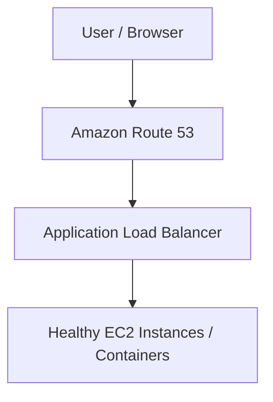

## Amazon Route 53, DNS, and AWS Load Balancers
Amazon Route 53, the Domain Name System (DNS), and AWS Load Balancers (Elastic Load Balancing - ELB), and how they work together to deliver highly available, scalable, and fault-tolerant web applications. Understanding the relationship between these services is essential when designing production-ready applications on AWS.

What is DNS (Domain Name System)?

The Domain Name System (DNS) is the internet's naming service. It translates human-readable domain names into IP addresses that computers use to communicate.

Without DNS, users would have to remember IP addresses instead of domain names.

Example

Instead of typing 3.6.10.171 users simply type www.example.com. DNS then resolves the domain name to its corresponding IP address,think of DNS as the phonebook of the internet.

**What is Amazon Route 53? Amazon Route 53 is AWS's highly available and scalable DNS web service, it performs three primary functions:**

1. Domain Registration: Purchase and manage domain names directly through AWS, example example.com, mycompany.com
2. DNS Routing: Route 53 maps domain names to AWS resources using DNS records stored inside Hosted Zones, It can route traffic to services such as: Amazon EC2, Application Load Balancer (ALB), Network Load Balancer (NLB), Amazon S3, Amazon CloudFront, AWS Elastic Beanstalk
3. Health Checks: Route 53 continuously monitors application endpoints, If an endpoint becomes unhealthy, Route 53 can automatically redirect users to a healthy backup resource.

**What is AWS Elastic Load Balancing (ELB)?**

An Elastic Load Balancer (ELB) distributes incoming traffic across multiple backend resources, Rather than allowing every user to connect directly to an EC2 instance, traffic first reaches the load balancer, which then forwards requests to healthy targets.

**Benefits include:**

+ High Availability
+ Fault Tolerance
+ Scalability
+ Automatic Health Checks
+ Better Performance

Common load balancer types include:

+ Application Load Balancer (ALB) – Layer 7 (HTTP/HTTPS)
+ Network Load Balancer (NLB) – Layer 4 (TCP/UDP)
**How Route 53 and Load Balancers Work Together**: In a production AWS environment, users do not connect directly to application servers, Instead, requests follow this path:




**This architecture improves scalability, security, and availability.**
```text
Request Flow
+----------------------+
|  Client / Browser    |
+----------------------+
           |
           | 1. User enters:
           |    app.example.com
           ▼
+----------------------+
| Amazon Route 53      |
| DNS Resolution       |
+----------------------+
           |
           | 2. Resolves the
           |    domain name to
           |    the Load Balancer
           ▼
+----------------------+
| Internet Gateway     |
+----------------------+
           |
           ▼
+----------------------+
| Application Load     |
| Balancer (Public)    |
+----------------------+
           |
           | 3. Performs health
           |    checks and
           |    distributes traffic
           ▼
+--------------------------------------+
| Private Subnets                      |
|                                      |
|  EC2 Instance A     EC2 Instance B   |
|       Healthy            Healthy     |
+--------------------------------------+
```
**Step-by-Step Request Execution**

Step 1 — DNS Resolution: The user enters https://app.example.com, route 53 checks the hosted zone and resolves the domain name to the DNS name of the Application Load Balancer.

Step 2 — Traffic Enters AWS: The request reaches the Internet Gateway, which forwards it to the public-facing Application Load Balancer.

Step 3 — Load Balancing: The Application Load Balancer:
+ Performs health checks
+ Identifies healthy targets
+ Selects an available backend server
+ Routes the request
Backend instances are usually deployed in private subnets across multiple Availability Zones (AZs). Real-World Example. High-Traffic E-Commerce Website.
Imagine an online store shop.mycompany.com during a large promotional event, millions of users access the website simultaneously.
**Dynamic Infrastructure**

AWS automatically scales the load balancer because the underlying IP addresses may change, pointing your domain directly to an IP address is unreliable.Instead, Route 53 uses an Alias Record, which automatically tracks the load balancer without requiring manual updates.

**Multi-Region Disaster Recovery**
Suppose your primary application is hosted in us-east-1, if the region becomes unavailable route 53 detects the failure using health checks, redirects traffic to a backup load balancer in another region (for example, us-west-2).
Users continue accessing the application with minimal interruption.
**Zero-Downtime Deployments**

**When deploying a new application version:**

+ The load balancer gradually routes traffic to the new version.
+ Health checks ensure only healthy instances receive requests.
+ Route 53 continues directing users to the same load balancer endpoint.

Users experience little to no downtime during the deployment.

## Key Route 53 Components

| Component | Description | Example Use Case |
| :--- | :--- | :--- |
| **Hosted Zone** | A container that stores DNS records for a domain. | Manage `example.com`, `api.example.com`, and `app.example.com`. |
| **Alias Record** | An AWS-specific DNS record that points directly to AWS resources. | Route `example.com` to an Application Load Balancer. |
| **Health Checks** | Continuously monitor endpoint availability. | Detect server failures and trigger automatic failover. |
| **Routing Policies** | Control how Route 53 answers DNS queries. | Direct users based on latency, geography, traffic weight, or failover status. |

---

## Common Route 53 Routing Policies

| Routing Policy | Purpose | Example |
| :--- | :--- | :--- |
| **Simple Routing** | Routes traffic to a single resource. | Small websites with one server. |
| **Weighted Routing** | Splits traffic based on percentages. | Send 80% of users to Version A and 20% to Version B. |
| **Latency-Based Routing** | Sends users to the AWS Region with the lowest latency. | European users connect to `eu-west-1`, while U.S. users connect to `us-east-1`. |
| **Failover Routing** | Redirects traffic when the primary endpoint becomes unhealthy. | Disaster recovery across Regions. |
| **Geolocation Routing** | Routes users based on their geographic location. | Display localized content to users in different countries. |
| **Geoproximity Routing** | Routes traffic based on the geographic location of users and AWS resources. | Shift traffic toward a nearby Region. |
| **Multivalue Answer Routing** | Returns multiple healthy IP addresses for a domain. | Improve availability across multiple servers. |

**Benefits of Using Route 53 with Load Balancers**
+ High Availability – Automatically routes traffic to healthy resources.
+ Fault Tolerance – Detects failures and redirects users to backup resources.
+ Scalability – Supports applications that automatically scale with demand.
+ Performance – Routes users to the most appropriate endpoint based on routing policies.
+ Simplified Management – Alias records automatically track AWS resources without manual IP updates.

